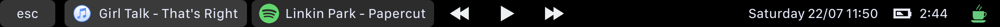
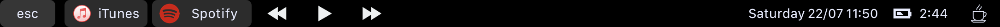
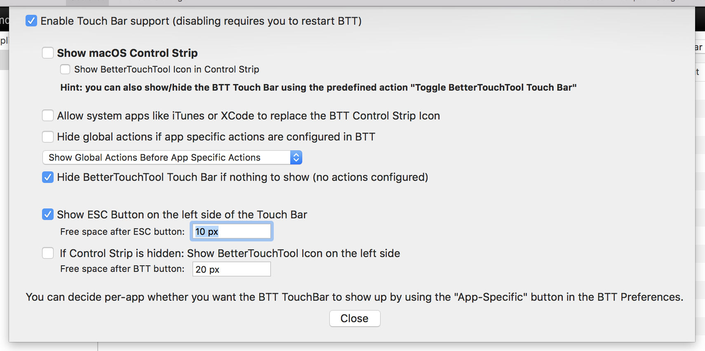

## TouchBar Customisations and Script

### Setting Up BetterTouchTool

To always show BetterTouchTool set the TouchBar settings to the following:

To toggle between BTT and the default TouchBar, go to Keyboard > Add New Shortcut and set the FN key (or whatever you want) to "Toggle BetterTouchTool Touch Bar".

### Widgets

Widgets on BetterTouchTool have two parts: the output and the action. The output shows data from an AppleScript and the action triggers an action (like playback controls).

- Caffeine
	- [`caffeine/status.applescript`](caffeine/status.applescript) for showing the status. Activate disabled icon on "`Inactive`"
	- [`caffeine/toggle.applescript`](caffeine/toggle.applescript) for the action to toggle
- iTunes/Spotify
	- `nowplaying.applescript` to show now playing. Activate alternate icon on `iTunes/Spotify`
- Media Controls
	- *NB: Relies on [BeardedSpice](https://github.com/beardedspice/beardedspice) to trigger media controls*
	- [`playback/playpause.applescript`](playback/playpause.applescript) for the play/pause button display. Checks against iTunes and Spotify.
	- [`playback/control.applescript`](playback/control.applescript) for triggering controls
- VPN
	- [`vpn/status.applescript`](vpn/status.applescript) to show status. Set `VPNName` to name of VPN from network settings
